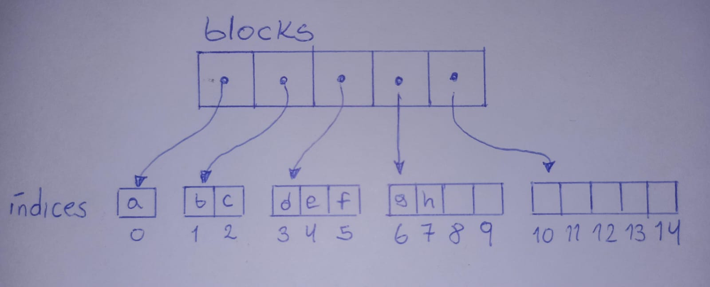

# Solucionario Examen Parcial CC232 Versión C

## Estudiante
- Jose Carlos Barrios Ponce 20232296K

### Pregunta 1

a) ADT: Es el contrato de IndexedBag\<T\>, se define que operaciones existen y que hacen.

Representación: Es la estructura interna elegida, en este caso son tres: ArrayStack, RootishArrayStack y SLList.

Implementación: Es el código concreto que realiza cada operación usando la representación.

b)
| Operación | ArrayStack | RootishArrayStack | SLList |
|---|---|---|---|
| add | O(1) amortizado | O(1) amortizado | O(1) |
| get | O(1) | O(1) | O(n) |
| contains | O(n) | O(n) | O(n) |
| removeOne | O(n) | O(n) | O(n) |

add: Los arreglos ocasionalmente hacen resize, por lo que son O(1) amortizado. SLList inserta al final en O(1) con puntero a tail.

get(i): el acceso directo por indice en arreglos es O(1), en SLList hay es O(n) porque debe recorrer cada nodo.

contains y removeOne: siempre debe recorrer todos los elementos en el peor caso por lo que es O(n) en los tres.

c) RootishArrayStack desperdicia menos memoria (O(√n) vs O(n)), pero get(i) requiere un cálculo extra para encontrar el bloque correcto, y el código es más complejo.

d) La operación más incómoda es get(i). Porque SLList no tiene acceso directo por índice, debe recorrer nodo por nodo hasta llegar a la posición i, lo cual es O(n).

e) 
```text
ALGORITMO uniqueStable

Para i ← 0 hasta size() - 1 hacer
    Para j ← 0 hasta i - 1 hacer
        Si get(j) = get(i) entonces
            removeOne(get(i))
            i ← i - 1
            Salir
        Fin si
    Fin para
Fin para

Fin algoritmo
```
El doble loop cuesta O(n²), removeOne dentro del loop cuesta O(n), en total seria O(n³) en el peor caso.
### Pregunta 2
a)
```text
sumRec(A, 4)
  sumRec(A, 3)
    sumRec(A, 2)
      sumRec(A, 1)
        sumRec(A, 0) → return 0
      return 0 + A[0] = 0 + 2 = 2
    return 2 + A[1] = 2 + 4 = 6
  return 6 + A[2] = 6 + 6 = 12
return 12 + A[3] = 12 + 8 = 20
```
b) Prueba por inducción sobre n
1. Caso Base (n=0): sumRec(A, 0) retorna 0, y la suma de 0 elementos es 0. 

2. Hipótesis de Inducción: Suponer que para algún n ≥ 0, sumRec(A, n) retorna correctamente A[0] + A[1] + ... + A[n-1].

3. Paso Inductivo (demostrar para n+1), sumRec(A, n+1) ejecuta: return sumRec(A, n) + A[n]

Por hipótesis de inducción, sumRec(A, n) = A[0] + ... + A[n-1]

Entonces:

sumRec(A, n+1) = A[0] + ... + A[n-1] + A[n]

c) Cada llamada hace O(1) trabajo, se hacen n llamadas, entonces en total es O(n).

La memoria del arreglo es O(n). Luego cada llamada recursiva ocupa un espacio en la pila y hay n llamadas apiladas simultáneamente por lo  que es O(n) (este es el espacio adicional).

d) Versión iterativa

```text
int sumaIterativa(const int A[], int n) {
    int sum = 0;
    for (int i = 0; i < n; i++) {
        sum = sum + A[i];
    }
    return sum;
}
```
El invariante es: Al inicio de cada iteración i, sum contiene la suma de A[0] + A[1] + ... + A[i-1].

e) const le dice al compilador y al programador que la función no va a modificar el arreglo, esto garantiza que sumRec solo lee A, nunca lo altera.

f) 
1. Arreglo vacío (n =0): La función debe retornar 0, sumRec(A,0) verifica que retorna 0 sin acceder a ningún elemento.

2. Arreglo de un solo elemento (n=1): La función debe retornar exactamente ese elemento, sumRec([5], 1) verifica que retorna 5.

### Pregunta 3
a) Identico al mostrado en clase.



b) Usando i2b(i) para el bloque b, y j = i - b*(b+1)/2 para el desplazamiento:

| i  | b = i2b(i) | j = i - b(b+1)/2 |
|---|---|---|
| 0  | 0 | 0 - 0 = 0 |
| 1  | 1 | 1 - 1 = 0 |
| 2  | 1 | 2 - 1 = 1 |
| 5  | 2 | 5 - 3 = 2 |
| 9  | 3 | 9 - 6 = 3 |
| 14 | 4 | 14 - 10 = 4 |

c) En RootishArrayStack los elementos están distribuidos en múltiples bloques, entonces dado un índice i no se sabe directamente en qué bloque está. La función i2b(i) calcula en cual bloque cae i.

d) Con r bloques, la capacidad total es r(r+1)/2 ≈ r²/2, entonces:

n ≈ r²/2, luego r ≈ √(2n) → r = O(√n)

e) Ambos acceden en O(1), no hay recorrido lineal. RootishArrayStack tiene get(i) que requiere primero calcular i2b(i) y luego j = i - b*(b+1)/2, Rootish sacrifica velocidad de acceso a cambio de menor desperdicio de memoria.

f) Crecer (grow()): Cuando la capacidad actual r*(r+1)/2 no alcanza para n+1 elementos, se agrega un nuevo bloque de tamaño r+1:

```text
blocks.add(blocks.size(), new T[blocks.size()+1]);
```
Solo se crea un bloque nuevo pequeño, sin copiar elementos existentes.

Reducir (shrink()): Cuando quedan demasiados bloques vacíos, es decir (r-2)*(r-1)/2 >= n, se elimina el último bloque:

```text
delete [] blocks.remove(blocks.size()-1);
```
### Pregunta 4
a)
```text
i = 0 → 0 < 3 → usa front:
front.get(3 - 0 - 1) = front.get(2) = 10

i = 2 → 2 < 3 → usa front:
front.get(3 - 2 - 1) = front.get(0) = 30

i = 3 → 3 >= 3 → usa back:
back.get(3 - 3) = back.get(0) = 40

i = 6 → 6 >= 3 → usa back:
back.get(6 - 3) = back.get(3) = 70
```
b) Ejecución de add(1,15):

```text
i = 1 < front.size() = 3, se inserta en front

front.add(3 - 1, 15) = front.add(2, 15)

front = [30,20,15,10]
back  = [40,50,60,70]

Secuencia lógica:
[10,15,20,30,40,50,60,70]
```
Ejecución de add(6,55) luego de ejecutar add(1,15):

```text
front.size() = 4, i = 6 >= 4, se inserta en back

back.add(6 - 4, 55) = back.add(2, 55)

front = [30,20,15,10]
back  = [40,50,55,60,70]

Secuencia lógica:
[10,15,20,30,40,50,55,60,70]
```
c) Porque front representa la primera mitad del deque, pero usando un ArrayStack que solo inserta o elimina eficientemente por el final. Al guardar front en orden inverso, el índice lógico 0 queda al final de front, que es donde ArrayStack opera en O(1). Así, agregar o eliminar al inicio del deque se traduce en agregar o eliminar al final de front que es O(1) amortizado, sin necesidad de desplazar elementos.

d) Una condición rezanobale de balance entre front y back es que ninguno de los dos arreglos debe tener más del triple de elementos que el otro:

```text
3*front.size() >= back.size()  Y  3*back.size() >= front.size()
```
Cuando se viola balance() redistribuye todos los n elementos equitativamente.

e) balance() cuesta O(n), pero no ocurre en cada operación, solo cuando un arreglo tiene más del triple que el otro. Para que se viole el balance, se necesitan al menos n/2 operaciones consecutivas insertando del mismo lado desde la última vez que se balanceó Entonces el costo de balance() se reparte entre todas esas operaciones:

```text
O(n) / (n/2 operaciones) = O(1) por operación
```

### Pregunta 5
a) SEList agrupa elementos en bloques (pequeños deques de tamaño x) enlazados entre sí como una DLList. En lugar de un nodo por elemento, hay un nodo por bloque.
La diferencia clave con DLList es el overhead, DLList tiene 2 punteros por elemento, SEList tiene 2 punteros por bloque de x elementos.

b) Todo bloque interno (salvo posiblemente el primero y el último) debe tener entre b-1 y b+1 elementos. Esto garantiza que los bloques ni estén casi vacíos (desperdiciando espacio) ni sobrecargados (forzando operaciones costosas).

c)Cuando se inserta en un bloque lleno (size == b+1), se busca espacio en los bloques siguientes:

- Búsqueda: se recorren hasta b bloques hacia adelante buscando uno con espacio.
- Desplazamiento: si se encuentra espacio, se empuja el último elemento de cada bloque al inicio del siguiente, liberando espacio en el bloque original.
- Bloque nuevo: si todos los b bloques siguientes están llenos, se crea un bloque nuevo con spread que redistribuye los elementos equitativamente.

d) ArrayDeque: Insertar en el centro requiere desplazar n/2 elementos, entonces es O(n).

SEList: Insertar en el centro solo requiere encontrar el bloque correcto en O(n/b) y desplazar a lo sumo b elementos dentro del bloque, entonces es O(b + n/b).
Con b = √n el costo es O(√n).

e) La interfaz expone get(i), add(i,x), remove(i) igual que cualquier lista. Internamente, getLocation(i) traduce el índice lógico al bloque y posición correctos, ocultando completamente la estructura de bloques. El usuario nunca interactúa con los bloques directamente.

f) Insertar y eliminar n elementos alternadamente en posiciones aleatorias, verificando después de cada operación que:

- size() es exactamente el valor esperado.
- to_vector() contiene exactamente los elementos correctos en el orden correcto.

### Pregunta 6
a) Prueba 1: Eliminar del frente cuando j está al final del arreglo. Capacidad 4, inserta [10,20,30] con j=3 cerca del límite, remove(0) debe calcular j = (j+1)%4 = 0, si no hay módulo, j se sale del arreglo y el accesk es inválido.

Prueba 2: Eliminar del medio cuando los elementos cruzan el límite físico. Capacidad 4, j=3, elementos en posiciones físicas [30,_,_,10;20], remove(1) debe usar en cada índice el desplazamiento % a.length, sin módulo los índices calculados apuntan fuera del arreglo.

b) Prueba 1: Eliminar en estructura de tamaño 1: Insertar un solo elemento add(0, 10) entonces n=1, j=0, remove(0) debe dejar n=0 y el deque vacío. Si el código no maneja n=1 correctamente, puede hacer desplazamientos innecesarios o dejar j en estado inválido.

Prueba 2: Eliminar en estructura de tamaño 2: Insertar dos elementos add(0,10) y add(1,20) entonces [10,20], remove(0) debe quedar [20] con n=1 y remove(1) debe quedar [10] con n=1.
Si el código confunde qué lado desplazar (i < n/2 con n=2 e i=1), puede dejar datos incompletos.

c) Las pruebas públicas solo cubren casos típicos como estructuras bien formadas y tamaños normales, wrap-around requieren pruebas adicionales específicas.

d) Invariante: 

```text
get(k) retorna el elemento lógico correcto para todo 0 <= k < n, usando a[(j+k) % a.length].
```

e) ASan detecta:
- Accesos fuera de los límites del arreglo físico.
- Uso de memoria ya liberada.

ASan no detecta:
- Errores lógicos donde el índice está dentro del arreglo físico pero es incorrecto semánticamente.

### Pregunta 7
a) apply(x)

Precondición: ninguna.

Comportamiento: agrega el estado x al final del historial. size() aumenta en 1.

undo()

Precondición: size() > 0 (debe haber al menos un estado).

Comportamiento: elimina el estado actual. size() disminuye en 1.

current()

Precondición: size() > 0.

Comportamiento: retorna el último estado agregado sin modificar el historial.

size()

Precondición: ninguna.

Comportamiento: retorna la cantidad de estados en el historial.

clear()

Precondición: ninguna.

Comportamiento: elimina todos los estados. size() queda en 0.

b) ArrayStack: Los estados se guardan en un arreglo, el último estado está en la posición n-1, current() = a[n-1]. El invariante es a[0....n-1] que contiene los estados en orden de insercción, n refleja el tamaño actual.

SLList: Cada nodo guarda un estado, el último nodo es el estado actual, currente()=tail.data. El invariante es que tail siempre apunta al último estado insertado o es null si el historial es vacío.

c) Comparación de costos

| Operación | Arreglo dinámico | Lista enlazada |
|---|---|---|
| apply(x) | O(1) amortizado | O(1) |
| undo() | O(1) | O(n) |
| current() | O(1) | O(1)  |
| clear() | O(1) | O(n) |

d) Si size() == 0 y se llama undo(), lanzar una excepción o retornar un error. Lo importante es que el historial nunca quede en estado inválido, size() nunca debe ser negativo y current() nunca debe llamarse con historial vacío. 

e) Secuencia larga: Hacer 1000 apply(x) seguidos, verificar que size() == 1000 y current() retorna el último estado. Luego 1000 undo() y verificar que size() == 0.

Estados repetidos: apply(5), apply(5), apply(5), verificar que size() == 3 y que cada undo() retrocede correctamente aunque los valores sean iguales.

Operaciones inválidas: undo() con historial vacío y current con historial vacío.

f) El arreglo dinámico es mejor, mantiene O(1) para todas las operaciones originales y agrega get(i) en O(1), mientras que en la lista enlazada seria O(n). Debemos recordar que SLList no fue diseñada par acceso por índice.


