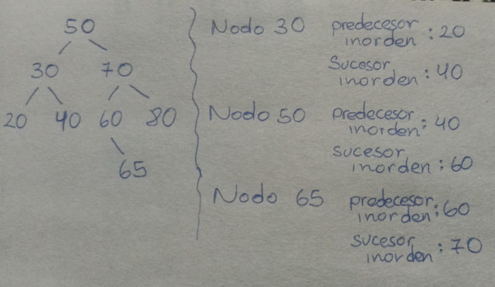
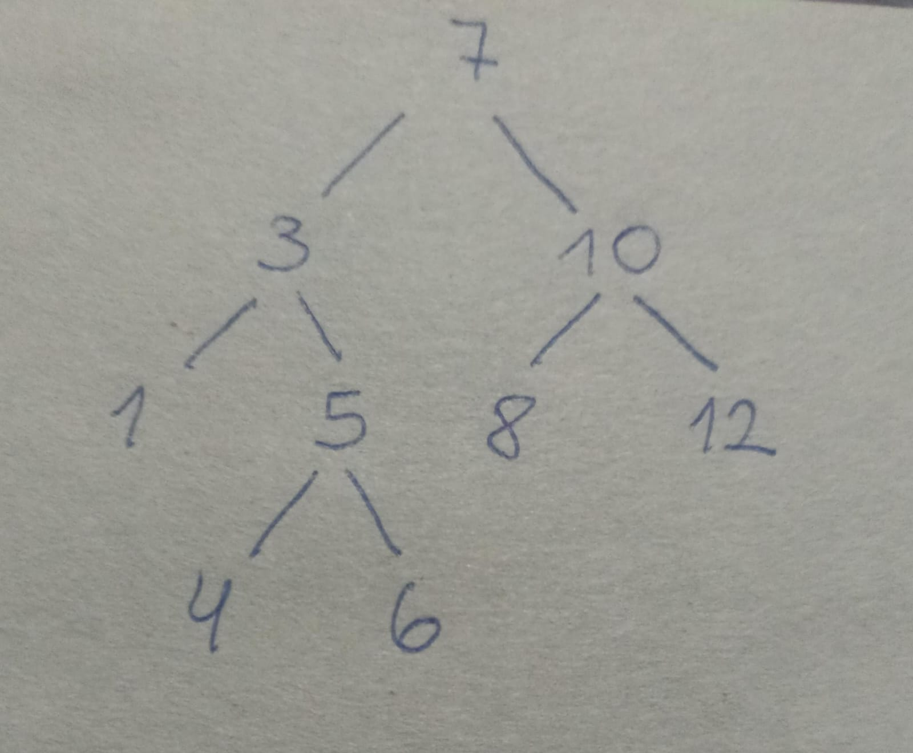

## Actividad 5 - CC232

### Estudiante

- Nombre: Jose Carlos Barrios Ponce

### Bloque 1 - Núcleo conceptual

1) En un  arbol binario enlazado la relación entre padre e hijo se da mediante dos punteros, uno al hijo izquierdo y otro al hijo derecho, mientras que en el arbol binario almacenado en un arreglo no hay punteros, la posición del índice codifica la relacion entre padre-hijo mediante formulas matematicas.

2) 
dato: Es el valor que almacena el nodo.

padre: Puntero al nodo que lo contiene.

hijoIzq: Puntero al hijo izquierdo.

hijoDer: Puntero al hijo derecho.

altura: Es la profundidad del subárbol.

3) El puntero parent permite moverse hacia arriba en el árbol. Sin él, desde un nodo solo se podria bajar hacia los hijos, quedando atrapado en esa rama. En succ(), pred() y la actualizacion ascendente de alturas es necesario subir por las ramas del arbol, sin parent es imposible aplicar estas funciones.

4) Se puede decir que BinNode trabaja desde la perspectiva de un nodo mientras que BinTree administra el árbol completo.

5) BinaryTree hereda todo de BinTree y agrega 2 cosas: iteradores y consultas de posición.

6) La propiedad es el invariante de orden, para todo nodo n, todos los valores en su subarbol izq son menores  y todos en su subarbol derecho son mayores. El invariante garantiza que buscar, insertar y eliminar cuesten O(h) en lugar de O(n). 

7) La propiedad es que todo nodo es menor o igual que sus hijos.

8) 
Propiedad BST: izquierda < nodo < derecha

Propiedad Heap (mínimo): padre <= ambos hijos

El BST ordena todos los elementos entre si. Saber que un valor está a la izquierda te dice su relación con los demas nodos. El heap solo ordena hacia arriba. Saber que unj nodo es hijo de otro solo te dice que el padre es menor.

9) El recorrido inorden visita los nodos en el orden de izquierda, nodo y derecha (esta en orden), en inorden se aplica esto en cada nodo entonces los subarboles producen valores ordenados, lo que da la secuencia ordenada completa.

10) Porque el heap no tiene orden global, solo garantiza que el padre es menor que sus hijos pero dos hermanos pueden estar en cualquier orden entre sí.

### Bloque 2 - Navegación, altura, profundidad y tamaño

1) Todos son metodos de consulta

hasLeft(): Tiene hijo izquierdo?

hasRight(): Tiene hijo derecho?

isRoot(): es la raiz del arbol?

isLeaf(): es una hoja (no tiene hijos)?

isLeaftChild(): es el hijo izquierdo de su padre?

isRightChild(): es el hijo derecho de su padre?

2) En el método succ(), si el nodo actual tiene hijo derecho, el sucesor inorder será el nodo más pequeño de ese subárbol derecho. Por eso primero se baja al hijo derecho y luego se continúa avanzando por los hijos izquierdos hasta llegar al nodo más a la izquierda; ese nodo es el siguiente que se visitaría en un recorrido inorder.

3) Si el nodo no tiene hijo derecho, succ() sube por los ancestros mientras el nodo actual sea hijo derecho de su padre. Cuando encuentra el primer ancestro del que proviene por la izquierda, ese ancestro es el sucesor inorder, porque es el siguiente nodo que se visitaría después de terminar todo el subárbol donde se encontraba el nodo original.

4) El método pred() funciona de manera simétrica a succ(). Si el nodo tiene hijo izquierdo, el predecesor inorder es el nodo más grande de ese subárbol izquierdo, por lo que baja al hijo izquierdo y luego avanza por los hijos derechos hasta llegar al más a la derecha. Si no tiene hijo izquierdo, sube por los ancestros mientras sea hijo izquierdo de su padre; cuando encuentra el primer ancestro del que proviene por la derecha, ese ancestro es el predecesor inorder, ya que es el nodo visitado inmediatamente antes en un recorrido inorder.

5) 

6) depth(u) calcula la profundidad de un nodo, es decir, la cantidad de aristas que lo separan de la raíz. Se implementa subiendo mediante el puntero parent porque cada nodo conoce a su padre; entonces basta con avanzar desde el nodo hasta la raíz contando cuántos niveles se recorren.

7) height(u) calcula la altura de un nodo, es decir, la longitud del camino más largo desde ese nodo hasta una hoja. Se implementa recursivamente bajando por los hijos porque para conocer la altura de un nodo es necesario conocer primero las alturas de sus subárboles izquierdo y derecho; luego se toma la mayor de ambas y se suma 1. En esta implementación, un nodo nulo tiene altura -1 y una hoja tiene altura 0. 

8) subtreeSize(u) calcula la cantidad total de nodos que existen en el subárbol cuya raíz es el nodo u, incluyendo al propio nodo. Se implementa de forma recursiva sumando 1 (el nodo actual) más el tamaño del subárbol izquierdo y el tamaño del subárbol derecho. Si el nodo es nullptr, el tamaño es 0.

9) Sea u un nodo cualquiera. La profundidad depth(u) es la distancia desde la raíz hasta u, y la altura height(u) es la distancia desde u hasta la hoja más profunda de su subárbol. Si unimos ambos recorridos obtenemos un camino desde la raíz hasta una hoja del árbol que pasa por u, cuya longitud es depth(u) + height(u). Como la altura del árbol height(T) es la longitud máxima de cualquier camino desde la raíz hasta una hoja, necesariamente se cumple que depth(u) + height(u) ≤ height(T).

10) La igualdad depth(u) + height(u) = height(T) se cumple si y solo si el nodo u pertenece a un camino de longitud máxima desde la raíz hasta una hoja más profunda del árbol. Es decir, u debe estar sobre alguna de las ramas que determinan la altura del árbol; en caso contrario, el camino que pasa por u será más corto que la altura máxima y la desigualdad será estricta.

### Bloque 3 - Recorridos y trazado guiado

| Recorrido | Versión revisada | Estructura auxiliar usada | Secuencia producida en el árbol de prueba | Argumento de correctitud y costo |
|------------|-----------------|---------------------------|------------------------------------------|----------------------------------|
| Preorden | Recursivo (`travPre`) | Pila implícita de recursión | 7, 3, 1, 5, 4, 6, 10, 8, 12 | Visita primero la raíz, luego el subárbol izquierdo y finalmente el derecho. Tiempo O(n), espacio O(h). |
| Preorden | Iterativo (`travPreIterative2`) | Pila explícita (`stack`) | 7, 3, 1, 5, 4, 6, 10, 8, 12 | Inserta primero el hijo derecho y luego el izquierdo para mantener el orden raíz-izquierda-derecha. Tiempo O(n), espacio O(h). |
| Inorden | Recursivo (`travInRecursive`) | Pila implícita de recursión | 1, 3, 4, 5, 6, 7, 8, 10, 12 | Recorre izquierda-raíz-derecha. Produce los elementos en orden creciente para un BST. Tiempo O(n), espacio O(h). |
| Inorden | Iterativo #1 (`travInIterative1`) | Pila explícita (`stack`) | 1, 3, 4, 5, 6, 7, 8, 10, 12 | Simula la recursión apilando el camino izquierdo y visitando al retroceder. Tiempo O(n), espacio O(h). |
| Inorden | Iterativo #2 (`travInIterative2`) | Punteros `parent`, `prev` y `curr` | 1, 3, 4, 5, 6, 7, 8, 10, 12 | Navega por el árbol usando relaciones padre-hijo sin pila adicional. Tiempo O(n), espacio O(1). |
| Inorden | Iterativo #3 (`travInIterative3`) | Sucesor inorder (`succ`) | 1, 3, 4, 5, 6, 7, 8, 10, 12 | Comienza en el nodo más a la izquierda y avanza mediante sucesores hasta terminar el recorrido. Tiempo O(n), espacio O(1). |
| Postorden | Recursivo (`travPost`) | Pila implícita de recursión | 1, 4, 6, 5, 3, 8, 12, 10, 7 | Visita izquierda-derecha-raíz. Garantiza que un nodo se procesa después de sus hijos. Tiempo O(n), espacio O(h). |
| Postorden | Iterativo (`travPostIterative`) | Dos pilas (`stack`) | 1, 4, 6, 5, 3, 8, 12, 10, 7 | La primera pila genera un orden inverso y la segunda restaura el orden postorden correcto. Tiempo O(n), espacio O(n). |
| Por niveles | Level Order (`travLevel`) | Cola (`queue`) | 7, 3, 10, 1, 5, 8, 12, 4, 6 | Visita los nodos nivel por nivel utilizando una cola FIFO. Tiempo O(n), espacio O(w), donde w es el ancho máximo del árbol. |

1) Visitar un nodo en preorden significa procesarlo antes que a sus hijos. Esto ocurre cuando se ejecuta visit(*this) al inicio del recorrido, por lo que el orden es raíz → subárbol izquierdo → subárbol derecho.

2) Visitar un nodo en inorden significa procesarlo después de recorrer completamente su subárbol izquierdo y antes de recorrer su subárbol derecho. El orden es subárbol izquierdo → raíz → subárbol derecho.

3) Visitar un nodo en postorden significa procesarlo únicamente después de haber recorrido completamente sus dos subárboles. El orden es subárbol izquierdo → subárbol derecho → raíz.

4) Visitar un árbol por niveles significa recorrer sus nodos nivel por nivel, de arriba hacia abajo y de izquierda a derecha dentro de cada nivel. Primero se visita la raíz, luego todos sus hijos, después todos los nietos, y así sucesivamente.

5) Los recorridos recursivos tienen tiempo O(n) porque cada nodo del árbol se visita exactamente una vez y en cada visita se realiza una cantidad constante de trabajo (procesar el nodo y hacer llamadas a sus hijos). Como hay n nodos y ninguno se procesa más de una vez, el tiempo total es proporcional al número de nodos del árbol.

6) Las versiones iterativas también tienen tiempo O(n) porque, aunque utilizan estructuras auxiliares como pilas o colas, cada nodo del árbol se procesa una sola vez. Las operaciones de insertar o retirar un nodo de una pila o cola cuestan O(1), por lo que al realizarse una cantidad proporcional a los n nodos, el tiempo total sigue siendo O(n).

7) En un árbol balanceado, la memoria auxiliar de un recorrido recursivo es O(log n), porque la pila de llamadas almacena como máximo un nodo por nivel del árbol y la altura de un árbol balanceado es logarítmica.

8) En un árbol degenerado, la memoria auxiliar de un recorrido recursivo es O(n), porque el árbol se comporta como una lista y la pila de llamadas puede llegar a almacenar los n nodos durante la recursión.

9) Si bien ambas almacenan información para continuar el recorrido, la diferencia es que una es manual y la otra automática.

10) Porque en un árbol completo hay niveles con muchos nodos y la cola debe almacenar gran parte de ellos al mismo tiempo durante el recorrido por niveles. En cambio, en un árbol degenerado casi siempre hay un solo nodo por nivel, por lo que la cola suele contener muy pocos elementos.

### Bloque 4 - Demos

| Archivo | Salida u observable importante | Idea estructural | Argumento de costo, espacio o diseño |
|----------|-------------------------------|------------------|--------------------------------------|
| `demo_binary_tree.cpp` | Muestra recorridos, sucesor, predecesor, altura y profundidad del árbol. | Uso de un árbol binario general con enlaces a padre e hijos. | Todos los recorridos visitan cada nodo una vez: O(n). El espacio auxiliar depende de la altura del árbol. |
| `demo_bst.cpp` | Muestra búsquedas, eliminación, rotaciones y construcción balanceada de un BST. | Mantiene la propiedad BST: izquierda < nodo < derecha. | Las operaciones de búsqueda, inserción y eliminación cuestan O(h), donde h es la altura del árbol. |
| `demo_heap.cpp` | Verifica el heap, inserta elementos y extrae mínimos en orden creciente. | Heap mínimo implementado sobre un vector. | `add()` y `remove()` cuestan O(log n); `top()` cuesta O(1); `heapify()` cuesta O(n). |
| `demo_capitulo5_panorama.cpp` | Integra BinaryTree, BST y Heap en un único ejemplo de uso. | Muestra cómo las estructuras comparten interfaces y utilidades comunes. | El iterador del BST permite recorrido STL-like en tiempo O(n) y espacio O(1) adicional. |

1) La salida que permite verificarlo son las líneas impresas por printVector() para cada recorrido, como "Preorden recursivo", "Inorden recursivo", "Postorden recursivo", "Niveles" y sus versiones iterativas. Al comparar las secuencias obtenidas con el árbol construido en el demo, se puede comprobar que cada algoritmo visita los nodos exactamente en el orden que define su recorrido corresponbdiente.

2) Tebnemos:

if (auto* succ = n5->succ()...) // imprime 6

if (auto* pred = n5->pred()...) // imprime 4

El árbol construido tiene inorden 1 3 4 5 6 7 8 10 12. Si succ(5) devuelve 6 y pred(5) devuelve 4, eso significa que succ() encontró exactamente el siguiente en esa secuencia y pred().

3) La línea:

std::cout << "Arbol:\n" << tree;

produce una representación visual del arbol.

4) La línea:

printVector("BST inorden", bst.inorder());

produce la secuencia 1 3 4 5 6 7 8 10 12, que es exactamente el conjunto insertado {7, 3, 10, 1, 5, 8, 12, 4, 6} en orden ascendente. Si el invariante BST no se mantuviera, el inorden no sería una secuencia ordenada.

5) 

6) La línea:

std::cout << "remove() -> " << heap.remove() << '\n';

extrae siempre el elemento en data_[0], si el heap es correcto, ese es el mínimo. 

7) heapify reorganiza todo el arreglo de una vez en O(n), mientras que add modifica incrementalmente un heap ya válido en O(log n), esto se refleja en que solo cambia la posición del elemento recién insertado.

8) La línea:

for (int x : bst) { std::cout << x << ' '; }

resume mejor la semana porque integra todo: el BST usa la infraestructura de BinaryTree (iteradores), que usa BinTree (memoria, altura), que usa BinNode (succ). Las tres capas funcionan juntas.

### Bloque 5 - Pruebas e invariantes

1) La prueba pública verifica operaciones como insertar (add), buscar (findEQ, find, lowerBound, upperBound), eliminar (remove), obtener el mínimo y máximo, recorrer el árbol en inorden y comprobar que siga cumpliendo la propiedad de BST.

2) La prueba pública intenta insertar nuevamente el valor 5 y espera que la operación falle. Así se verifica que el BST no permite elementos repetidos.

expect(!bst.add(5), "BST no debe aceptar duplicados");

3) Se verifica que todas las implementaciones del recorrido inorder produzcan exactamente la misma secuencia de nodos. Si los resultados coinciden, significa que las versiones iterativas recorren el árbol correctamente igual que la versión recursiva.

4) Se espera que findEQ(8) encuentre el nodo que contiene exactamente el valor 8 y que no devuelva nullptr.

5) Se espera que lowerBound(9) devuelva el primer valor mayor o igual que 9, que en este caso es 10, y que upperBound(8) devuelva el primer valor estrictamente mayor que 8, que también es 10.

6) Se valida que el árbol mantenga la propiedad de un BST: todos los valores del subárbol izquierdo deben ser menores que el nodo y todos los del subárbol derecho deben ser mayores. Si esta condición se cumple en todo el árbol, isBST() devuelve true.

7) Después de ejecutar remove(), se valida que el nodo haya desaparecido del árbol, que el recorrido inorder siga estando ordenado y que los enlaces parent continúen siendo correctos.

8) Valida que cada nodo siga apuntando correctamente a su padre después de modificar la estructura del árbol.

9) La prueba pública valida que el heap se construya correctamente con heapify, que cumpla la propiedad de heap con isHeap(), que remove() extraiga siempre el mínimo y que isHeapArray() reconozca un arreglo que representa un heap válido.

10) Demuestra que remove() siempre extrae el elemento mínimo y que el heap mantiene su propiedad después de cada extracción. Por eso, al vaciar completamente el min-heap, los elementos salen en orden creciente.

11) Se valida que se pueda adjuntar un subárbol a otro árbol (attachAsRC), separar un subárbol conservando su estructura (secede) y eliminar un subárbol completo (removeSubtree). Además, se comprueba que los tamaños de los árboles se actualicen correctamente.

12) Las pruebas internas agregan verificaciones más específicas: que las rotaciones izquierda y derecha mantengan el orden del BST, que bubbleUp y remove coloquen correctamente el mínimo en un heap, que depth() y height() calculen valores correctos, y que los recorridos mediante sucesor y predecesor produzcan el orden esperado.

13) Pasar las pruebas públicas demuestra que las funcionalidades principales funcionan correctamente en los casos que fueron evaluados: recorridos, búsquedas, inserciones, eliminaciones, heaps, rotaciones y manejo de subárboles. Sin embargo, no garantiza que el programa esté libre de errores para todos los casos posibles.

14) Pasar las pruebas públicas no demuestra que la implementación sea correcta para todos los casos posibles. Solo indica que funciona en los escenarios que fueron incluidos en esas pruebas; aún podrían existir errores en casos límite o situaciones que no fueron evaluadas.

15) Porque los resultados observables muestran que el programa funciona en ciertos casos de prueba, pero los invariantes explican por qué la estructura sigue siendo correcta después de cada operación y la complejidad justifica su eficiencia.

### Bloque 6 - Lectura cercana de código

1) En BinNode, el invariante es que cada hijo debe apuntar correctamente a su padre mediante parent, y que left y right representen los hijos izquierdo y derecho.

2) insertAsLC e insertAsRC deben rechazar la inserción si el hijo correspondiente ya existe porque cada nodo de un árbol binario solo puede tener un hijo izquierdo y un hijo derecho.

3) size() de BinNode recorre recursivamente todo el subárbol contando el nodo actual y luego sumando el tamaño de sus hijos izquierdo y derecho, si existen.

4) leftmost() y rightmost() buscan los extremos del subárbol. leftmost() avanza repetidamente por los hijos izquierdos hasta encontrar un nodo que ya no tenga hijo izquierdo, mientras que rightmost() hace lo mismo por los hijos derechos. Así obtienen, respectivamente, el nodo más a la izquierda y el más a la derecha del subárbol.

5) succ() busca el sucesor inorder de un nodo. Primero, si el nodo tiene hijo derecho, baja a ese subárbol y avanza por los hijos izquierdos hasta llegar al nodo más a la izquierda, que será el sucesor. Si no tiene hijo derecho, sube por los punteros parent hasta encontrar un ancestro del que el nodo provenga por la izquierda; ese ancestro es el sucesor. Si no existe tal ancestro, el nodo no tiene sucesor.

6) pred() busca el predecesor inorder de un nodo. Primero, si el nodo tiene hijo izquierdo, baja a ese subárbol y avanza por los hijos derechos hasta llegar al nodo más a la derecha, que será el predecesor. Si no tiene hijo izquierdo, sube por los punteros parent hasta encontrar un ancestro del que el nodo provenga por la derecha; ese ancestro es el predecesor. Si no existe tal ancestro, el nodo no tiene predecesor.

7) En BinTree, root_ guarda el puntero a la raíz del árbol, mientras que size_ almacena la cantidad total de nodos.

8) updateHeight(Node*) recalcula la altura de un nodo a partir de las alturas de sus hijos y actualiza su valor.

9) updateHeightAbove(Node*) actualiza la altura de un nodo y luego continúa con sus ancestros hasta llegar a la raíz. Sube hacia la raíz porque un cambio en un subárbol puede modificar la altura de sus padres, por lo que es necesario recalcular todas las alturas afectadas.

10) attachAsLC y attachAsRC transfieren un subárbol de un árbol a otro enlazando su raíz como hijo izquierdo o derecho del nodo indicado. Luego actualizan los punteros parent, el tamaño de los árboles y dejan vacío el árbol del que se tomó el subárbol, evitando que ambos compartan los mismos nodos.

11) La diferencia es que removeSubtree elimina completamente un subárbol y libera sus nodos, mientras que secede solo separa ese subárbol del árbol original y lo devuelve como un nuevo árbol independiente, conservando todos sus nodos.

12) secede no debe destruir los nodos porque su objetivo es separar un subárbol para convertirlo en un nuevo árbol independiente. Si los eliminara, se perdería la información y no podría seguir utilizándose.

13) removeSubtree sí debe liberar los nodos porque su objetivo es eliminar completamente ese subárbol del árbol. Si no los liberara, la memoria seguiría ocupada y se producirían fugas de memoria.

14) checkParentLinks() verifica que los punteros parent sean consistentes en todo el árbol, es decir, que cada hijo apunte correctamente a su nodo padre.

15) En BinaryTree, firstNode() devuelve el nodo más a la izquierda del árbol, lastNode() devuelve el más a la derecha, nextNode() obtiene el siguiente nodo en recorrido inorder usando el sucesor (succ()), y prevNode() obtiene el anterior usando el predecesor (pred()).

16) Un iterador basado en succ() produce un recorrido inorder porque comienza en el nodo más a la izquierda (firstNode()) y luego avanza siempre al sucesor de cada nodo. Así, visita los elementos de menor a mayor siguiendo el orden propio del recorrido inorder.

17) asciiArt() aporta una representación visual del árbol, lo que facilita verificar su estructura durante la depuración y explicarla en una sustentación.

### Bloque 7 - BST

1) La propiedad de un BST (Binary Search Tree) es que, para cada nodo, todos los valores de su subárbol izquierdo son menores que el valor del nodo y todos los valores de su subárbol derecho son mayores.

2) El recorrido inorden de un BST produce una secuencia no decreciente porque siempre visita primero el subárbol izquierdo, luego el nodo y finalmente el subárbol derecho. Como en un BST los valores de la izquierda son menores y los de la derecha mayores, el resultado queda ordenado.

3) findEQ busca una clave exacta; find busca una clave y, si no existe, devuelve el primer valor mayor o igual (similar a lowerBound); lowerBound devuelve el primer elemento mayor o igual que la clave; y upperBound devuelve el primer elemento estrictamente mayor que la clave.

4) findEQ(x) puede fallar porque solo devuelve un nodo si encuentra exactamente la clave x. En cambio, lowerBound(x) puede no fallar porque, aunque x no exista, devuelve el primer valor que sea mayor o igual a x.

5) 

6) 
Inorden: 1, 3, 4, 5, 6, 7, 8, 10, 12

Preorden: 7, 3, 1, 5, 4, 6, 10, 8, 12

Postorden: 1, 4, 6, 5, 3, 8, 12, 10, 7

Recorrido por niveles: 7, 3, 10, 1, 5, 8, 12, 4, 6

7) 
lowerBound(9): se empieza en 7 (9 > 7, se va a la derecha), luego en 10 (10 ≥ 9, se guarda como posible respuesta y se intenta ir a la izquierda), se llega a 8 (8 < 9, se intenta ir a la derecha y no hay más nodos). Por eso, el resultado final es 10.

upperBound(8): se empieza en 7 (8 > 7, se va a la derecha), luego en 10 (10 > 8, se guarda como posible respuesta y se intenta ir a la izquierda), se llega a 8 (8 no es estrictamente mayor que 8, se va a la derecha y no hay más nodos). Por eso, el resultado final es 10.

8) En un BST existen tres casos de eliminación: si el nodo es una hoja, simplemente se elimina; si tiene un solo hijo, ese hijo ocupa su lugar; y si tiene dos hijos, normalmente se reemplaza por su sucesor o predecesor en inorden y luego se elimina ese nodo, manteniendo la propiedad del BST.

9) splice cumple el papel de desconectar un nodo del BST y reemplazarlo por su único hijo, o por nullptr si no tiene hijos, actualizando los enlaces necesarios. Esto simplifica la eliminación y ayuda a mantener la estructura correcta del árbol.

10) Después de eliminar una clave, deben seguir cumpliéndose la propiedad del BST (izquierda < nodo < derecha), el recorrido inorder debe permanecer ordenado y los enlaces parent deben ser correctos.

11) remove(3) debe conservar el inorder ordenado porque, aunque se elimine un nodo, el árbol debe seguir cumpliendo la propiedad de un BST. Si el inorder dejara de estar ordenado, significaría que la estructura del árbol se rompió.

12) rotateLeft realiza una rotación hacia la izquierda, haciendo que el hijo derecho del nodo suba a su posición y que el nodo original pase a ser su hijo izquierdo.

13) rotateRight realiza una rotación hacia la derecha, haciendo que el hijo izquierdo del nodo suba a su posición y que el nodo original pase a ser su hijo derecho.

14) Una rotación local preserva la propiedad BST porque solo cambia la relación entre un nodo y su hijo, pero no altera el orden relativo de las claves. Los valores que eran menores siguen quedando a la izquierda y los mayores a la derecha, por lo que el recorrido inorder permanece ordenado.

15) Construir un BST balanceado desde un arreglo ordenado sirve para obtener un árbol con menor altura, haciendo que las búsquedas, inserciones y eliminaciones sean más eficientes.

16) En un BST balanceado, la búsqueda tiene costo O(log n) porque la altura del árbol es pequeña y se descarta aproximadamente la mitad de los nodos en cada paso. En un BST degenerado, la búsqueda cuesta O(n) porque el árbol se comporta como una lista y puede ser necesario recorrer todos los nodos.

### Bloque 8 - Heap

1) Un heap binario puede almacenarse en un std::vector porque es un árbol completo, por lo que la posición de cada padre e hijos puede calcularse mediante índices del arreglo sin necesidad de usar punteros.

2) Si un nodo está en la posición i, sus hijos ocupan las siguientes posiciones disponibles del nivel siguiente. Por ello, el hijo izquierdo se encuentra en 2*i + 1 y el hijo derecho en 2*i + 2. De forma inversa, un nodo en la posición i tiene como padre al elemento ubicado en la mitad de su índice, es decir, parent(i) = (i - 1) / 2 usando división entera.

3) La propiedad de un min-heap es que el valor de cada nodo debe ser menor o igual que el de sus hijos.

4) top() devuelve el mínimo porque, en un min-heap, la propiedad del heap garantiza que el nodo raíz es menor o igual que todos sus hijos y, por extensión, que todos los demás elementos. Por eso, el mínimo siempre está en la primera posición del heap.

5) bubbleUp(i) restaura la propiedad del heap comparando el elemento recién insertado con su padre. Si el nuevo elemento es menor, ambos se intercambian y el proceso continúa desde la nueva posición. Este procedimiento se repite hasta que el nodo ya no sea menor que su padre o llegue a la raíz, quedando nuevamente un min-heap.

6) trickleDown(i) restaura la propiedad del heap después de eliminar la raíz colocando el último elemento en esa posición. Luego lo compara con sus hijos y, si es mayor que el menor de ellos, los intercambia.

7) remove() debe mover el último elemento a la raíz porque, al eliminar el mínimo, queda un espacio vacío en esa posición. Colocar allí el último elemento mantiene la forma de árbol completo del heap y luego trickleDown(0) lo desplaza hacia abajo hasta restaurar la propiedad del min-heap.

8) isHeap() verifica que se cumpla la propiedad de un min-heap, es decir, que cada nodo tenga un valor menor o igual que el de sus hijos. Si esta condición se cumple en toda la estructura, devuelve true.

9) Construir un heap insertando n elementos uno por uno requiere aplicar bubbleUp en cada inserción, por lo que cuesta O(n log n). En cambio, construirlo con heapify() reorganiza el arreglo completo de forma más eficiente y tiene costo O(n), por eso es preferible cuando ya se tienen todos los elementos.

10) Insertar n elementos uno por uno cuesta O(n log n) en el peor caso porque cada inserción puede requerir un bubbleUp que suba hasta la raíz, lo cual cuesta O(log n). Al repetir este proceso para los n elementos, el costo total es n × O(log n) = O(n log n).

11) heapify() puede ejecutarse en O(n) porque no aplica bubbleUp a cada elemento, sino que comienza desde los últimos nodos internos y realiza trickleDown solo donde es necesario. La mayoría de los nodos están cerca de las hojas y requieren muy pocos movimientos, por lo que el trabajo total es lineal, O(n).

12) La extracción completa produce la secuencia 1, 2, 3, 5, 7, 8, 10. Esto ocurre porque en un min-heap cada llamada a remove() extrae el elemento mínimo actual; luego el heap se reorganiza con trickleDown, dejando nuevamente el siguiente mínimo en la raíz. Al repetir el proceso hasta vaciar el heap, los elementos salen en orden creciente.

13) Para consultar el mínimo repetidamente conviene un heap, porque el mínimo siempre está en la raíz y top() lo obtiene en O(1). En cambio, para búsquedas ordenadas conviene un BST, porque permite recorrer los elementos en orden mediante inorder y realizar operaciones como find, lowerBound y upperBound.

### Bloque 9 - Cierre comparativo

Al pasar de listas, pilas y colas a árboles binarios, heaps y BST, dejamos de trabajar con estructuras lineales y empezamos a trabajar con estructuras jerárquicas. Ahora es importante mantener invariantes como la propiedad del heap o la propiedad BST, además de considerar la altura del árbol, ya que esta afecta directamente la eficiencia de las operaciones.

### Autoevaluación breve

- Qué puedo defender con seguridad:
- Qué todavía confundo:
- Qué evidencia usaría en una sustentación:
- Qué parte del código me parece más importante para revisar otra vez:
